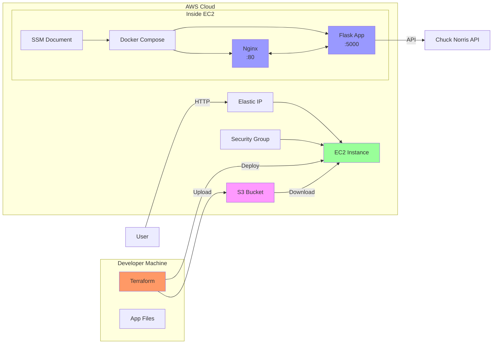

# Chuck Norris Jokes - DevOps Assessment

A fully automated deployment pipeline demonstrating Infrastructure as Code (IaC) and configuration management best practices using Python Flask, Docker, Terraform, and AWS.

## Overview

This project displays random Chuck Norris jokes fetched from [Chuck Norris API](https://api.chucknorris.io/) and demonstrates:

- **Terraform** - Infrastructure as Code (AWS EC2, Security Groups, S3, IAM)
- **Docker** - Containerization with 2 containers (Flask app + Nginx proxy)
- **AWS SSM** - Secure instance access and script execution without SSH keys
- **SSM Document + Association** - Automated server configuration
- **S3** - Application file storage
- **Auto SSH Security** - Security group auto-detects your public IP (optional)

## Architecture



### Architecture Flow

1. **Deployment**: Developer runs `terraform apply` → uploads files to S3 → creates EC2 instance
2. **Configuration**: SSM Association triggers SSM Document on EC2 → downloads files → runs Docker Compose
3. **Access**: User accesses app via Elastic IP → Nginx proxy → Flask app → Chuck Norris API
4. **Management**: AWS SSM for secure instance access (no SSH keys needed)

## Quick Start

### Prerequisites

- AWS CLI configured with credentials
- Terraform >= 1.0
- Docker >= 20.10 (for local testing)
- SSH key pair in AWS (optional, only needed for SSH access)
- AWS Session Manager plugin (recommended, for SSM access)

### Deployment

```bash
# 1. Configure Terraform variables
cd terraform
cp terraform.tfvars.example terraform.tfvars
# Edit terraform.tfvars with your AWS key pair name

# 2. Initialize and deploy
terraform init
terraform plan
terraform apply

# 3. Get Elastic IP
terraform output elastic_ip

# 4. Access application
curl http://<ELASTIC-IP>
# Or open in browser: http://<ELASTIC-IP>
```

## Configuration

Edit `terraform/terraform.tfvars`:

```hcl
region            = "ap-southeast-3"
instance_type     = "t3.nano"
key_name          = null  # Optional, set to use SSH
allowed_ssh_cidr  = null  # Auto-detects your public IP
```

## Features

- **AWS SSM Access**: Secure instance access without SSH keys
- **SSM Document Execution**: Automated server configuration via SSM (no user data)
- **Auto SSH Security (Optional)**: Security group restricts SSH to your current IP
- **2-Container Docker**: Flask app + official Nginx proxy
- **S3 Storage**: Encrypted app files with versioning
- **IAM Roles**: Minimal permissions for EC2 and SSM
- **File Change Detection**: Auto re-deploys when files change
- **Elastic IP**: Static public IP for consistent access

## Project Structure

```
chucknoris-jokes/
├── app/                    # Flask Application
│   ├── server.py
│   ├── templates/index.html
│   ├── static/style.css
│   └── requirements.txt
├── docker/                   # Container Config
│   ├── Dockerfile           # Flask app container
│   ├── nginx.conf          # Nginx proxy config
│   └── docker-compose.yml   # 2 containers
├── terraform/                # IaC
│   ├── main.tf             # AWS resources
│   ├── variables.tf        # Configuration
│   ├── outputs.tf          # Outputs
│   ├── ssm-document.yaml  # SSM Command document
│   └── terraform.tfvars    # Dev environment variables
├── scripts/                  # Automation (backup/reference)
│   └── setup.sh          # Legacy deployment script
├── .gitignore              # Exclude secrets
├── .env.example            # Environment variables example
├── README.md               # This file
└── AI.md                   # Detailed documentation
```

## Deployment Workflow

1. Developer modifies `app/` or `docker/` files
2. Runs `terraform apply`
3. Terraform detects file changes (SHA256 hash)
4. Files are zipped and uploaded to S3
5. EC2 instance is created/recreated
6. SSM Document is created with setup commands
7. SSM Association runs document on instance
8. Setup script downloads files from S3
9. Docker Compose builds and starts containers
10. Application accessible via Elastic IP
11. Instance access via AWS SSM (no SSH key required)

## Security Features

- **AWS SSM Access**: Secure instance access without SSH keys
- **Auto SSH Restriction (Optional)**: Security group can auto-detect deployer's public IP for SSH
- **S3 Encryption**: AES256 encryption at rest with versioning
- **IAM Least Privilege**: EC2 instance can only access specific S3 bucket
- **No Secrets in Git**: Sensitive values in `.tfvars.example`, `.env.example`

## Cost Estimation

| Resource | Cost (Monthly) |
|----------|----------------|
| EC2 t3.nano | ~$4.80 |
| Elastic IP | ~$3.60 |
| EBS 8GB | ~$0.64 |
| S3 Storage (~1GB) | ~$0.02 |
| Data Transfer | Free tier: 100GB |
| **Total** | **~$9 USD** |

**Free Tier**: EC2 and EBS are free for 12 months

## Re-deploy on File Changes

```bash
# Modify app/ or docker/ files
cd terraform

# Terraform detects hash changes and re-deploys automatically
terraform apply -auto-approve
```

## Clean Up

```bash
cd terraform

# Destroy all resources
terraform destroy
```

## Troubleshooting

### Access EC2 via AWS SSM

```bash
# Install Session Manager plugin if not already installed
# https://docs.aws.amazon.com/systems-manager/latest/userguide/session-manager-working-with-install-plugin.html

# Connect to instance
aws ssm start-session --target <INSTANCE-ID> --region ap-southeast-3
```

Or use the output from Terraform:

```bash
terraform output ssm_command
```

### Check Container Logs

```bash
aws ssm start-session --target <INSTANCE-ID> --region ap-southeast-3

# In the SSM session:
cd /opt/chucknoris-jokes/docker
docker-compose logs
```

### Force Re-deployment

```bash
cd terraform
# Taint the upload resource to force re-upload
terraform taint null_resource.upload_app_files
terraform apply
```

## Technology Stack

| Technology | Purpose |
|------------|---------|
| Python 3.11 | Flask application |
| Flask 3.0 | Web framework |
| Docker | Containerization |
| Docker Compose | Multi-container orchestration |
| Nginx | Reverse proxy (official image) |
| Terraform 1.0+ | Infrastructure as Code |
| AWS S3 | File storage |
| AWS EC2 | Compute |
| AWS IAM | Security |
| AWS SSM | Remote management |

## Documentation

For detailed documentation, see [AI.md](AI.md) which includes:
- Complete architecture details
- Security best practices
- File change detection mechanism
- Provisioner flow
- Troubleshooting guide
- Future enhancements

---

**License**: This project is for assessment purposes.
