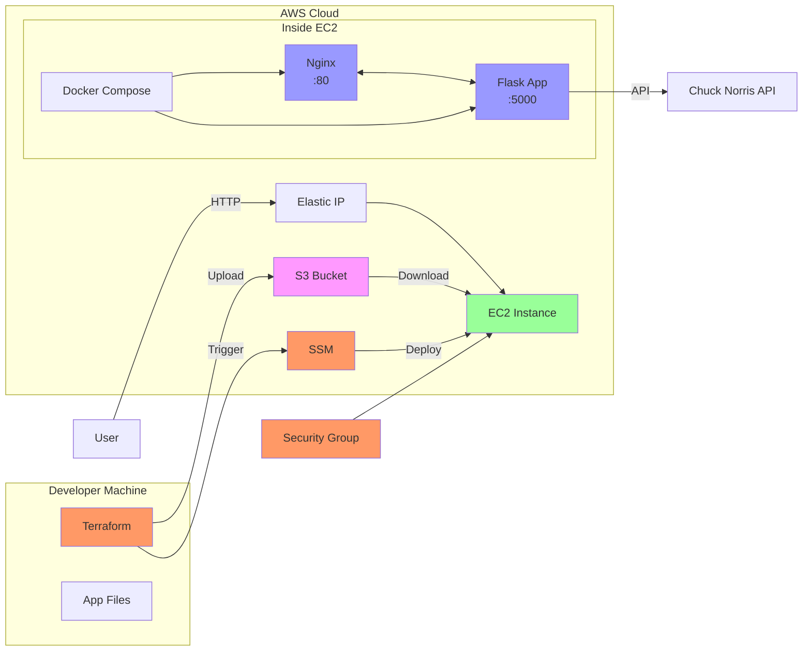

# Chuck Norris Jokes - DevOps Assessment

A fully automated deployment pipeline demonstrating Infrastructure as Code (IaC) and configuration management best practices using Python Flask, Docker, Terraform, and AWS.

## Overview

This project displays random Chuck Norris jokes fetched from [Chuck Norris API](https://api.chucknorris.io/) and demonstrates:

- **Terraform** - Infrastructure as Code (AWS EC2, Security Groups, S3, IAM)
- **Docker** - Containerization with 2 containers (Flask app + Nginx proxy)
- **AWS SSM** - Secure instance access and script execution without SSH keys
- **SSM Document + Association** - Automated server configuration
- **S3** - Application file storage
- **Auto SSH Security** - Security group auto-detects your public IP (optional)

## Architecture



### Architecture Flow

1. **Deployment**: Developer runs `terraform apply` → uploads files to S3 → creates SSM Document & Association
2. **Configuration**: SSM Association triggers SSM Document on EC2 → downloads files → runs Docker Compose
3. **Access**: User accesses app via Elastic IP → Nginx proxy → Flask app → Chuck Norris API
4. **Management**: AWS SSM for secure instance access (no SSH keys needed)

## Quick Start

### Prerequisites

- AWS CLI configured with credentials
- Terraform >= 1.14
- Docker >= 20.10 (for local testing)
- SSH key pair in AWS (optional, only needed for SSH access)
- AWS Session Manager plugin (recommended, for SSM access)

### Deployment

```bash
# 1. Configure Terraform variables
cd terraform
cp terraform.tfvars.example terraform.tfvars
# Edit terraform.tfvars with your own environment variables

# 2. Initialize and deploy
terraform init
terraform plan
terraform apply

# 3. Get Elastic IP
terraform output elastic_ip

# 4. Access application
curl http://<ELASTIC-IP>
# Or open in browser: http://<ELASTIC-IP>
```

## Configuration

Copy the example file and customize your settings:

```bash
cd terraform
cp terraform.tfvars.example terraform.tfvars
```

Edit `terraform.tfvars`:

```hcl
# AWS Region
region            = "ap-southeast-3"

# EC2 Instance Type
instance_type     = "t3.nano"

# Project and Environment
project_name      = "chucknoris-jokes"
environment       = "dev"

# SSH Key Pair (optional - for SSH access only, not required for SSM)
# Create key pair in AWS EC2 console first
key_name          = "your-existing-key-pair-name"

# VPC Configuration (optional - leave null for default VPC)
vpc_id            = null

# Subnet Configuration (optional - leave null for auto-selection)
# Subnet must have public IP assignment enabled and route to Internet Gateway
subnet_id         = null

# SSH Access Security (optional - leave null for auto-detection)
# Auto-detects your current public IP or specify custom CIDR blocks
allowed_ssh_cidr  = null
```

## Features

- **AWS SSM Access**: Secure instance access without SSH keys
- **SSM Document Execution**: Automated server configuration via SSM (no user data)
- **Auto SSH Security (Optional)**: Security group restricts SSH to your current IP
- **2-Container Docker**: Flask app + official Nginx proxy
- **S3 Storage**: Encrypted app files with versioning
- **IAM Roles**: Minimal permissions for EC2 and SSM
- **File Change Detection**: Auto re-deploys when files change
- **Elastic IP**: Static public IP for consistent access

## Design Considerations

### 1. Single Server Architecture
- **Decision**: Use one server to host both web server (Nginx) and application server (Flask)
- **Reasoning**: For simple systems, single server is sufficient and cost-effective
- **Trade-off**: For complex systems requiring better security and isolation, separating web and application servers is recommended

### 2. No Ansible Implementation
- **Decision**: Not using Ansible for configuration management
- **Reasoning**: Keeps the deployment pipeline simple and reduces complexity
- **Trade-off**: Ansible would be advisable for more complex systems requiring advanced configuration management

### 3. File Change Detection
- **Decision**: Terraform detects code changes and triggers re-deployment without recreating EC2 instance
- **Reasoning**: Minimizes downtime and preserves instance state
- **Trade-off**: Brief downtime during container rebuild; SSM Association re-triggers deployment script on existing instance

### 4. Default VPC Usage
- **Decision**: Terraform will NOT create VPC - it uses AWS default VPC for simplification
- **Reasoning**: Reduces configuration complexity and follows AWS best practices for simple deployments
- **Trade-off**: Custom VPC configurations would provide more network isolation and control

### 5. No ECR (Elastic Container Registry)
- **Decision**: Build Docker images directly on EC2 instance, not push to ECR
- **Reasoning**: Simpler for single-instance deployment; no additional storage/transfer costs
- **Trade-off**: No image versioning or reuse across multiple instances; slower builds and wasted compute resources

### 6. AWS SSM for Team-Friendly Access
- **Decision**: Use AWS Systems Manager (SSM) instead of SSH for instance access
- **Reasoning**: Eliminates need to manually add public keys to EC2 instances or manage SSH access
- **Benefit**: More secure and team-friendly with AWS-managed authentication

## Future Improvements

### 1. Configuration Management
- **Add Ansible**: Implement Ansible for advanced configuration management in complex systems
- **Benefit**: Better idempotency, configuration reuse, and multi-server orchestration

### 2. Static Frontend Approach
- **Consider**: Build frontend-only that calls Chuck Norris API directly
- **Architecture**: AWS CloudFront + S3 (static hosting)
- **Benefits**:
  - More cost-efficient (no EC2 instance)
  - Easier to manage (no server patching/maintenance)
  - Better scalability
  - Lower operational overhead

### 3. HTTPS Implementation
- **Current Limitation**: HTTPS requires a domain name
- **Future**: Add SSL/TLS certificates using AWS Certificate Manager (ACM)
- **Benefits**: Secure data transmission, better SEO, compliance

### 4. Auto Scaling Group (ASG)
- **Add ASG**: Implement Auto Scaling Group for high availability
- **Benefits**:
  - Automatic scaling based on traffic
  - Multiple instances for redundancy
  - Load balancer integration
- **When needed**: Application becomes complex and experiences variable traffic

### 5. Terraform Backend
- **Add Terraform Backend**: Use S3 with DynamoDB for remote state
- **Benefits**:
  - Team collaboration on shared infrastructure
  - State locking to prevent conflicts
  - Versioned state files
  - Better security (state not stored locally)

### 6. CI/CD Pipeline
- **Add CI/CD**: Implement GitHub Actions or AWS CodePipeline
- **Workflow**:
  - Automated testing on code push
  - Automatic Docker image build and push to ECR
  - Automatic Terraform apply
  - Rollback capabilities
- **Benefits**: Faster deployments, reduced human error, consistent processes

## Project Structure

```
chucknoris-jokes/
├── app/                        # Flask Application
│   ├── server.py
│   ├── templates/index.html
│   ├── static/style.css
│   └── requirements.txt
├── docker/                     # Container Config
│   ├── Dockerfile              # Flask app container
│   ├── nginx.conf              # Nginx proxy config
│   └── docker-compose.yml      # 2 containers
├── terraform/                   # IaC
│   ├── main.tf                 # AWS resources
│   ├── variables.tf            # Configuration
│   ├── outputs.tf              # Outputs
│   ├── ssm-document.yaml       # SSM Command document
│   └── terraform.tfvars        # Dev environment variables
├── scripts/                    # Automation (backup/reference)
│   └── setup.sh                # Legacy deployment script
├── .gitignore                  # Exclude secrets
├── README.md                   # This file
└── AGENTS.md                   # Detailed documentation
```

## Deployment Workflow

1. Developer modifies `app/` or `docker/` files
2. Runs `terraform apply`
3. Terraform detects file changes (SHA256 hash) - triggers file re-upload to S3
4. Terraform creates EC2 instance, SSM Document, and SSM Association (on first deployment)
5. SSM Association triggers SSM Document on EC2 instance (runs on creation/recreation)
6. SSM Document executes: downloads files, installs Docker, runs Docker Compose
7. Docker Compose builds and starts containers
8. Application accessible via Elastic IP
9. Instance access via AWS SSM (no SSH key required)

**Note**: EC2 instance is NOT recreated on file changes - only files are re-uploaded to S3 and SSM Association re-triggers the deployment script

## Security Features

- **AWS SSM Access**: Secure instance access without SSH keys
- **Auto SSH Restriction (Optional)**: Security group can auto-detect deployer's public IP for SSH
- **S3 Encryption**: AES256 encryption at rest with versioning
- **IAM Least Privilege**: EC2 instance can only access specific S3 bucket
- **No Secrets in Git**: Sensitive values in `terraform.tfvars` are git-ignored

## Re-deploy on File Changes

```bash
# Modify app/ or docker/ files
cd terraform

# Terraform detects hash changes and re-deploys automatically
# Files are re-uploaded to S3 and SSM Association re-triggers deployment script
# EC2 instance is NOT recreated
terraform apply -auto-approve
```

## Clean Up

```bash
cd terraform

# Destroy all resources
terraform destroy
```

## Troubleshooting

### Access EC2 via AWS SSM

```bash
# Install Session Manager plugin if not already installed
# https://docs.aws.amazon.com/systems-manager/latest/userguide/session-manager-working-with-install-plugin.html

# Connect to instance
aws ssm start-session --target <INSTANCE-ID> --region ap-southeast-3
```

Or use the output from Terraform:

```bash
terraform output ssm_command
```

### Check Container Logs

```bash
aws ssm start-session --target <INSTANCE-ID> --region ap-southeast-3

# In the SSM session:
cd /opt/chucknoris-jokes/docker
docker-compose logs
```

### Force Re-deployment

```bash
cd terraform
# Taint the upload resource to force re-upload
terraform taint null_resource.upload_app_files
terraform apply
```

---

**License**: This project is for assessment purposes.
